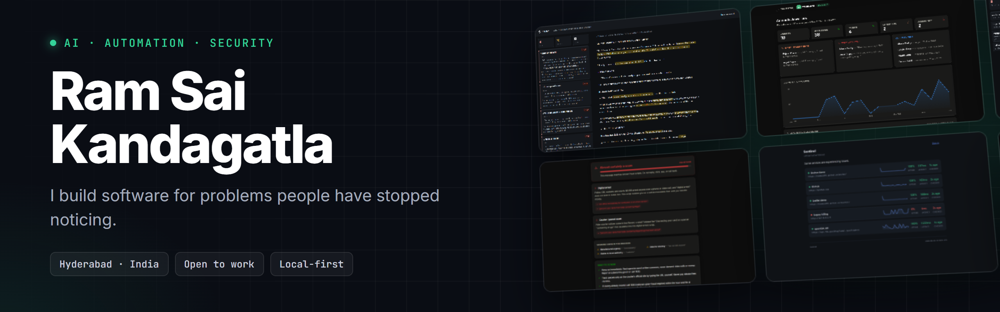

  

  
  

I design and ship **AI-powered systems and intelligent workflows**: the kind that quietly remove work instead of adding another dashboard to check.

- **Local-first by default.** Your data should not need to leave your device to be useful. Several of my tools run 100% in the browser with no backend at all.
- **Answer, don't decorate.** A verdict beats a chart. A countdown beats a spreadsheet.
- **The best problems are invisible.** Not the ones everyone is solving; the ones everyone has learned to live with.

---

## Featured

<table>
  <tr>
    <td width="50%"></td>
    <td width="50%"></td>
  </tr>
  <tr>
    <td>Reads a contract and cites the exact clause behind every finding. <a href="https://ramsai676.github.io/anchor/#demo"><b>Try it →</b></a></td>
    <td>Your medicines' FDA-documented risks, each quoted from its label. <a href="https://ramsai676.github.io/leaflet/"><b>Try it →</b></a></td>
  </tr>
  <tr>
    <td></td>
    <td></td>
  </tr>
  <tr>
    <td>Customer intelligence from WhatsApp exports, entirely in your browser. <a href="https://ramsai676.github.io/whatslens/"><b>Try it →</b></a></td>
    <td>Paste a suspicious message; get the exact Indian scam script named. <a href="https://ramsai676.github.io/scamlens/"><b>Try it →</b></a></td>
  </tr>
  <tr>
    <td></td>
    <td></td>
  </tr>
  <tr>
    <td>Acoustic predictive maintenance in a browser tab. VoltHacks 2026. <a href="https://ramsai676.github.io/hum-acoustic-monitor/"><b>Try it →</b></a></td>
    <td>An agent that pages the human who knows, then learns the answer.</td>
  </tr>
</table>

---

## 🔍 Cited, never generated

Tools that only ever quote their sources, so they cannot hallucinate.

| Project | What it does | |
|---|---|---|
| [**Anchor**](https://github.com/ramsai676/anchor) | Finds obligations, deadlines and risks in a contract and shows the clause each one came from. | [Demo ↗](https://ramsai676.github.io/anchor/#demo) |
| [**Termwise**](https://github.com/ramsai676/termwise) | Tracks the deadlines and duties inside your contracts, each one cited to its clause. | |
| [**Leaflet**](https://github.com/ramsai676/leaflet) | Serious warnings for the medicines you take, quoted from FDA-approved labels. | [Demo ↗](https://ramsai676.github.io/leaflet/) |
| [**Signalpost**](https://github.com/ramsai676/signalpost-agent) | Resolves a Norwegian organisation number into a company profile where every fact links to its source. | |

## ⭐ The Unnoticed Series

Five products, one thesis: *the most valuable problems are the ones nobody has bothered to name.* Each is local-first, open source, and built to be used in under a minute.

| # | Project | The problem nobody named | |
|---|---|---|---|
| **1/5** | [**WhatsLens**](https://github.com/ramsai676/whatslens) | Your WhatsApp already knows your best customers: dormant VIPs, hot leads, life events. | [Demo ↗](https://ramsai676.github.io/whatslens/) |
| **2/5** | [**AmIAutomatable**](https://github.com/ramsai676/amiautomatable) | Which parts of your job can AI already do? Task by task, across 9 roles. | [Demo ↗](https://ramsai676.github.io/amiautomatable/) |
| **3/5** | [**ScamLens**](https://github.com/ramsai676/scamlens) | Your fraud instincts are out of date. Get a verdict naming the exact scam script. | [Demo ↗](https://ramsai676.github.io/scamlens/) |
| **4/5** | [**LicenseGuard**](https://github.com/ramsai676/licenseguard) | You're non-compliant and don't know it yet. Expiry countdowns for every business license. | [Demo ↗](https://ramsai676.github.io/licenseguard/) |
| **5/5** | [**EverWell**](https://github.com/ramsai676/everwell) | A daily WhatsApp check-in for parents living alone, with family escalation. | |

## 🛠️ Developer tools

Small, dependency-free tools that do one job properly.

| Project | What it does |
|---|---|
| [**Sentinel**](https://github.com/ramsai676/sentinel) | Uptime monitoring with a public status page, dashboard and JSON API. Zero dependencies. |
| [**Relay**](https://github.com/ramsai676/relay) | Declarative AI workflows: chain HTTP, LLM, filter and notify steps with retries and timeouts. |
| [**Tessera**](https://github.com/ramsai676/tessera) | Join data to administrative boundaries, report honestly what didn't match, render SVG choropleths. |
| [**Switchboard**](https://github.com/ramsai676/switchboard-agent) | Routes a question to whoever knows, on their own channel, then learns the answer. |

## 🧩 Apps & platforms

| Project | What it does |
|---|---|
| [**EduMate**](https://github.com/ramsai676/digital_dynamos) | A learning platform with a Socratic AI tutor that answers in guiding questions, plus mentor matching, credits, leaderboards and verifiable certificates. Built by team Digital Dynamos. [Live ↗](https://digital-dynamos.vercel.app) |
| [**SecureNote**](https://github.com/ramsai676/digitalbrings-notesecure) | A local-first vault for passwords, API keys and recovery codes that also maps the registrar, DNS, hosting and renewals behind every site you run. No account, no cloud, no telemetry. [Download ↗](https://digitalbrings-securenote.netlify.app) |

## 🤖 AI Business Toolkit

Six focused tools that automate the unglamorous parts of running a business.

| Tool | What it does |
|---|---|
| [**Business RAG Chatbot**](https://github.com/ramsai676/ai-business-rag-chatbot) | Embeddable support chatbot answering from a company's own FAQ via BM25 retrieval, with citations. |
| [**Lead Generator**](https://github.com/ramsai676/ai-lead-generator) | Finds local businesses on OpenStreetMap and ranks them as sales leads. CSV export. |
| [**Outreach Automation**](https://github.com/ramsai676/ai-outreach-automation) | Tailored cold outreach for email, WhatsApp and SMS, plus a landing-page mockup, from one profile. |
| [**Phishing Detector**](https://github.com/ramsai676/ai-phishing-detector) | Flags phishing in email, SMS or chat with a risk score and a plain-English explanation. |
| [**Website Security Scanner**](https://github.com/ramsai676/ai-website-security-scanner) | Audits a site's HTTP security configuration and returns a graded report with the exact fix. |
| [**WhatsApp Automation Bot**](https://github.com/ramsai676/ai-whatsapp-bot) | Meta Cloud API bot: FAQ answers, multi-step lead capture and human handoff, with a simulator. |

## 🛰️ Hackathons & research

| Event | Project | |
|---|---|---|
| **VoltHacks 2026** | [**Hum**](https://github.com/ramsai676/hum-acoustic-monitor): acoustic predictive maintenance, on-device | [Demo ↗](https://ramsai676.github.io/hum-acoustic-monitor/) |

---

**Focus areas:** AI & automation · retrieval systems (RAG, BM25) · local-first architecture · workflow design · application security

I write about digital systems, security, and the realities of AI in software at **Digital Brings Insights**.

**Open to work** across AI, automation and security engineering: on-site, hybrid or remote.

